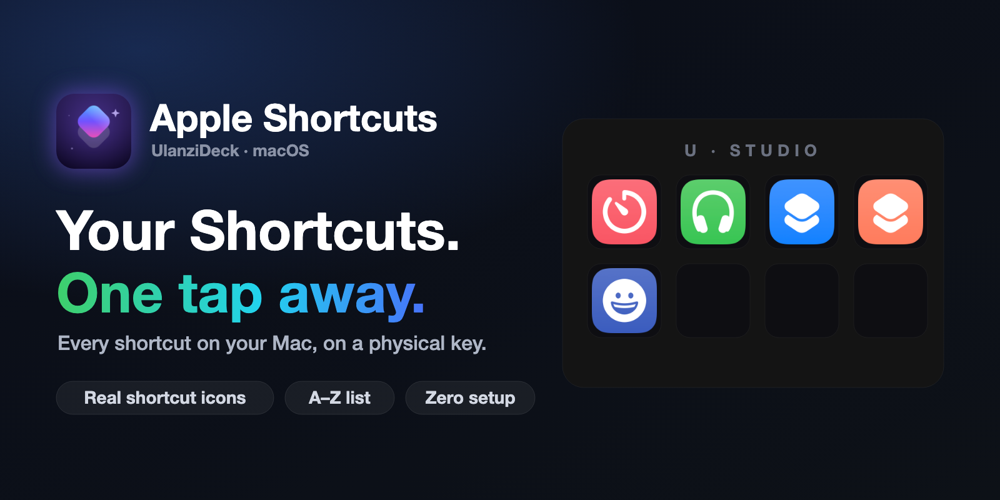
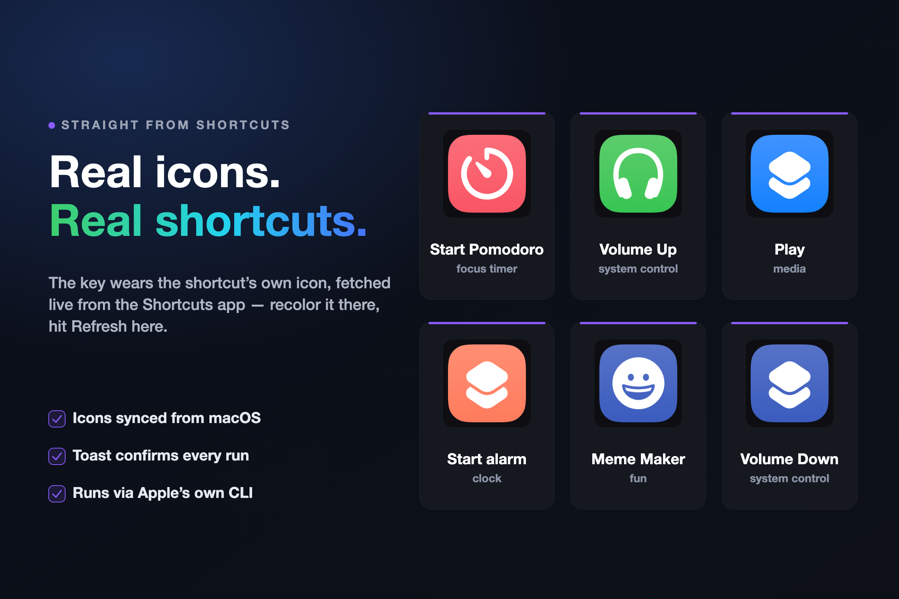
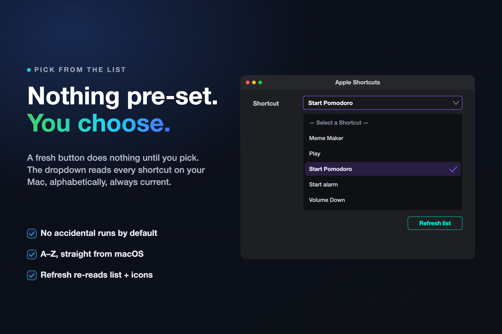

# Apple Shortcuts - Ulanzi Deck Plugin

**Every shortcut on your Mac, on a physical key.**

Pick any shortcut from a live list and run it with one tap — the button even wears the shortcut's own icon.



[](https://ulanzicommunitystore.narlei.com)
[](LICENSE)
[]()
[]()

> **Disclaimer:** this is an independent, open-source project. It is **not affiliated with, endorsed by, or supported by Apple**. It drives the `shortcuts` command-line tool that ships with macOS.

---

## Why this exists

You've already built the automation — a HomeKit scene, a focus timer, a deploy script wrapped in a shortcut. But running it means opening the Shortcuts app, or the menu bar, or remembering yet another hotkey.

Apple Shortcuts puts any shortcut on a physical button: glance at its real icon, tap, done. Your automations finally feel like hardware.

---

## Install

**From the Ulanzi Community Store (recommended):** open the Store app, search for **Apple Shortcuts**, click Install.

**From source:**

```bash
git clone https://github.com/narlei/ulanzideck-apple-shortcuts
cd ulanzideck-apple-shortcuts
make install   # bundle deps + copy into UlanziDeck + restart Ulanzi Studio
```

> **Requirements:** macOS 12+ (the `shortcuts` CLI ships with Monterey and later) · [Ulanzi Studio](https://www.ulanzi.com/pages/download)
>
> **First run:** macOS may ask permission for Ulanzi Studio to run shortcuts / control other apps — allow it.

---

## Real icons. Real shortcuts.

Drag **Run Shortcut** to a key and pick a shortcut. The button then shows that shortcut's **own icon** — the exact colored tile you see in the Shortcuts app, fetched live from macOS.



| Moment | What the button shows |
|---|---|
| Nothing selected yet | The plugin icon — tapping does nothing until you pick |
| Shortcut selected | The shortcut's real icon, full-bleed |
| Icon changed in the Shortcuts app | Old icon until you hit **Refresh list** — that also re-fetches icons |
| Tap succeeds | Toast: `Ran "Start Pomodoro"` |
| Tap fails | Toast with the CLI's error + alert badge on the key |

Long-running shortcuts are welcome: runs get a **5-minute timeout** instead of being killed after seconds.

---

## Nothing pre-set. You choose.

A fresh button defaults to **— Select a Shortcut —** and does nothing until you explicitly pick. No accidental HomeKit scenes at 2 AM.



- The dropdown lists **every** shortcut on your Mac, alphabetically, read live via `shortcuts list --show-identifiers`.
- Shortcuts are saved by **UUID**, not name — rename a shortcut in the app and the button keeps working.
- If the saved shortcut was deleted, the entry stays visible (disabled) instead of silently running something else.
- **Refresh list** re-reads both the list *and* every cached icon.

---

## Privacy & security

- **Everything runs locally.** The plugin drives macOS's own `shortcuts` CLI and the Shortcuts app's scripting interface — no network calls of its own, ever.
- **No analytics, no telemetry.** Nothing about your shortcuts or runs is collected or transmitted.
- **Open source.** Every line is in this repo — audit it yourself.

---

## How it works

- **Listing** uses `shortcuts list --show-identifiers` and parses `Name (UUID)` lines.
- **Running** uses `shortcuts run <uuid>`.
- **Icons** come from the Shortcuts app's AppleScript interface (`Shortcuts Events`), which exposes each shortcut's icon as TIFF data; the plugin writes it out, converts to PNG with `sips`, and pushes it to the key as base64. Icons are cached per-UUID and invalidated by **Refresh list**.

> **A hard-won detail:** the `shortcuts` binary hangs forever if its stdin is a plain pipe — the default when spawning from Node. The plugin spawns it with stdin **ignored**, which is why your taps come back instantly. If you're building your own tool around the CLI, you're welcome.

---

## Development

```bash
git clone https://github.com/narlei/ulanzideck-apple-shortcuts
cd ulanzideck-apple-shortcuts
make install   # sync to UlanziDeck + restart Ulanzi Studio
```

| Command | What it does |
|---|---|
| `make package` | Build distributable ZIP → `dist/` |
| `make install` | Bundle deps + copy into UlanziDeck + restart |
| `make restart` | Restart Ulanzi Studio only |
| `make bump_patch` | Bump version (patch / minor / major) |
| `node tools/gen-banners.mjs` | Regenerate README/store art (then rasterize with Chrome headless) |

**Layout**

```
com.narlei.appleshortcuts.ulanziPlugin/   # the plugin bundle
├── app.js                 # main service (Node.js)
├── scripts/               # get-shortcut-icon.applescript
├── property-inspector/    # shortcut picker UI
├── plugin-common-node/    # Ulanzi WebSocket SDK
└── resources/             # icon.svg / icon.png
```

---

MIT © [Narlei Moreira](https://github.com/narlei)
